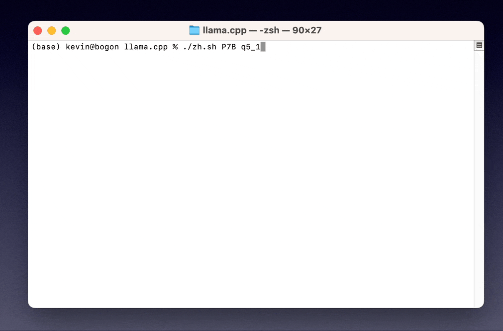

[**中文**](./README.md) | [**English**](./README_EN.md)

     
    
     

    
    
    
    

以ChatGPT、GPT-4等为代表的大语言模型（Large Language Model, LLM）掀起了新一轮自然语言处理领域的研究浪潮，展现出了类通用人工智能（AGI）的能力，受到业界广泛关注。然而，由于大语言模型的训练和部署都极为昂贵，为构建透明且开放的学术研究造成了一定的阻碍。

为了促进大模型在中文NLP社区的开放研究，本项目开源了**中文LLaMA模型和经过指令精调的Alpaca大模型**。这些模型在原版LLaMA的基础上扩充了中文词表并使用了中文数据进行二次预训练，进一步提升了中文基础语义理解能力。同时，在中文LLaMA的基础上，本项目使用了中文指令数据进行指令精调，显著提升了模型对指令的理解和执行能力。

***声明：本项目相关资源仅供学术研究使用。***

**本项目主要内容：**

- 🚀 开源了经过中文文本数据预训练的中文LLaMA大模型
- 🚀 开源了进一步经过指令精调的中文Alpaca大模型
- 🚀 快速地使用笔记本电脑（个人PC）本地部署和体验量化版大模型

💡 下图给出了7B版本模型本地化部署后的实际体验效果（动画未经加速，Apple M1 Max下实测）。

----

[多模态VLE](https://github.com/iflytek/VLE) | [中文MiniRBT](https://github.com/iflytek/MiniRBT) | [中文LERT](https://github.com/ymcui/LERT) | [中英文PERT](https://github.com/ymcui/PERT) | [中文MacBERT](https://github.com/ymcui/MacBERT) | [中文ELECTRA](https://github.com/ymcui/Chinese-ELECTRA) | [中文XLNet](https://github.com/ymcui/Chinese-XLNet) | [中文BERT](https://github.com/ymcui/Chinese-BERT-wwm) | [知识蒸馏工具TextBrewer](https://github.com/airaria/TextBrewer) | [模型裁剪工具TextPruner](https://github.com/airaria/TextPruner)

## 新闻

2023/3/28 感谢关注，本项目在逐渐完善内容中，将很快与各位分享更多信息。

## 内容导引
| 章节                                  | 描述                                                         |
| ------------------------------------- | ------------------------------------------------------------ |
| [模型下载](#模型下载)         | 中文LLaMA、Alpaca大模型下载地址                |
| [合并模型](#合并模型) | （重要）介绍如何将下载的LoRA模型与原版LLaMA合并 |
| [本地快速部署](#本地快速部署)       | 介绍了如何对模型进行量化并使用个人电脑部署并体验大模型 |
| [系统效果](#系统效果) | 介绍了部分场景和任务下的使用体验效果             |
| [训练细节](#训练细节) | 介绍了中文LLaMA、Alpaca大模型的训练细节 |
| [局限性](#局限性) | 本项目涉及模型的局限性 |

## 模型下载

TBA 

## 合并模型

TBA

## 本地快速部署

TBA

## 系统效果

TBA

## 训练细节

TBA

## 局限性

虽然本项目中的模型相比原版LLaMA和Alpaca在中文理解和生成能力上得到显著提升，但也存在以下局限性：

- 可能会产生不可预测的有害内容以及不符合人类偏好和价值观的内容
- 由于算力和数据问题，相关模型的训练并不充分，中文理解能力有待进一步提升
- 暂时没有在线可互动的demo（注：用户仍然可以自行在本地部署）

## 致谢

本项目基于以下开源项目二次开发，在此对相关项目和研究开发人员表示感谢。

- Facebook LLaMA: https://github.com/facebookresearch/llama
- Stanford Alpaca: https://github.com/tatsu-lab/stanford_alpaca
- alpaca-lora by @tloen: https://github.com/tloen/alpaca-lora
- llama.cpp by @ggerganov: https://github.com/ggerganov/llama.cpp

## 免责声明

本项目相关资源仅供学术研究之用，严禁用于商业用途。使用涉及第三方代码的部分时，请严格遵循相应的开源协议。模型生成的内容受模型计算、随机性和量化精度损失等因素影响，本项目无法对其准确性作出保证。对于模型输出的任何内容，本项目不承担任何法律责任，亦不对因使用相关资源和输出结果而可能产生的任何损失承担责任。

本项目由个人及协作者业余时间发起并维护，因此无法保证能及时回复解决相应问题。

## 问题反馈
如有问题，请在GitHub Issue中提交。

- 在提交问题之前，请先查看FAQ能否解决问题，同时建议查阅以往的issue是否能解决你的问题。
- 重复以及与本项目无关的issue会被[stable-bot](stale · GitHub Marketplace)处理，敬请谅解。
- 礼貌地提出问题，构建和谐的讨论社区。
